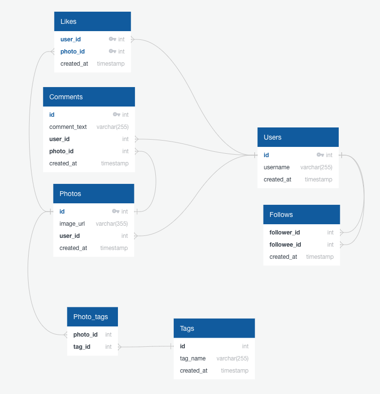

# Instragram Accounts Analysis

  

## Project Goals

- [Insert](https://github.com/junnpp/data-anaylsis-projects/blob/main/mysql-instragram-project/ig-database.sql) and [analyze](https://github.com/junnpp/data-anaylsis-projects/blob/main/mysql-instragram-project/analysis.sql) cloned Instagram dataset using MySQL.
- Answer questions for a marketing campaign, ad targeting, bot/celebrity filters, etc.
- Some of the questions are as follows:
  - What is the most popular weekday to register new users?
  - What are the percentages of users who either 1) never liked a post or 2) liked every single post?
  - Who are the top 5 users with the most average number of likes?
