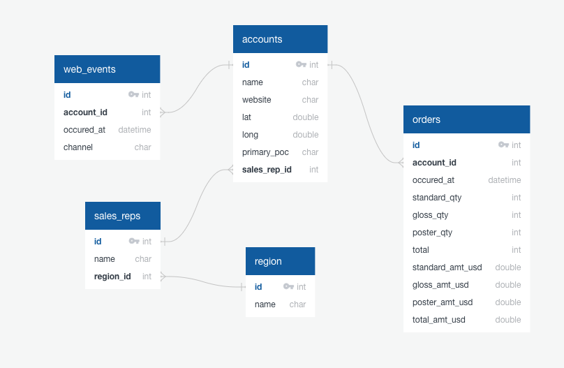

# E-Commerce Datasets Analysis - Parch & Posey

  

## Project Goals

- [Preprocess](https://github.com/junnpp/data-anaylsis-projects/blob/main/mysql-parch-and-posey-analysis/preprocessing.sql) and [analyze](https://github.com/junnpp/data-anaylsis-projects/blob/main/mysql-parch-and-posey-analysis/analysis.sql) multiple e-commerce datasets of a fictional company, Parch & Posey.
- Answer questions regarding e-commerce business using advanced SQL concepts such as CTE, view, update/alter table, window functions, etc. Some of the questions are as follows:
  - For the companies that have spent more per order on average than the average of all orders, what is the average amount of total sales?
  - For the top 10 accounts that have spent the most spent money, what is the average amount spent?
  - For each company with the largest total sales amount per region, how many orders were placed?